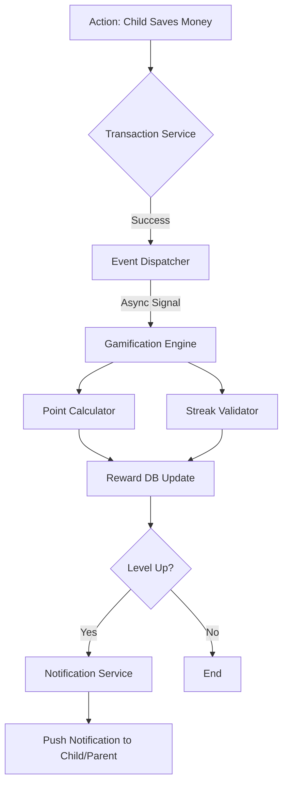

# Gamification Data Flow

This document describes how data moves through the Hapo-Pay system to power the gamification engine.

## 1. Event Sources
Gamification data is driven by "Events" occurring in other modules:
- **Transaction Module:** Spend, Save, Top-up events.
- **User Module:** Daily login, Profile completion.
- **Children Module:** Goal setting, Budget adherence.

## 2. Flow Diagram



## 3. Detailed Logic Flow (Python/Pseudocode)

### 3.1 Point Calculation Pipeline

```python
def calculate_points(event_type, metadata):
    base_points = CONFIG.get(f'BASE_{event_type}', 0)
    
    # Apply multipliers
    multiplier = 1.0
    if metadata.get('is_weekend'):
        multiplier *= 1.2
    if metadata.get('streak_bonus'):
        multiplier += 0.5
        
    return int(base_points * multiplier)
```

### 3.2 State Consistency
To ensure data integrity, especially when multiple events happen simultaneously:
1. Use database transactions (ACID).
2. Use F-expressions in Django to avoid race conditions.
   ```python
   # Example: Atomic update
   Reward.objects.filter(child_id=child_id).update(
       total_points=F('total_points') + earned_points,
       available_points=F('available_points') + earned_points
   )
   ```

## 4. Low-Level Event Queue (Conceptual C)

For high-throughput processing, a message queue consumer in C could handle raw event packets.

```c
/**
 * Process a stream of events from a fast memory pipe
 */
void consume_event_stream(const uint8_t *buffer, size_t size) {
    for (size_t i = 0; i < size; i += sizeof(EventPacket)) {
        EventPacket *packet = (EventPacket *)(buffer + i);
        
        // Dispatch to handler based on type
        switch(packet->type) {
            case EVENT_SAVE:
                apply_points(packet->child_id, 50);
                break;
            case EVENT_LOGIN:
                update_streak(packet->child_id);
                break;
        }
    }
}
```
