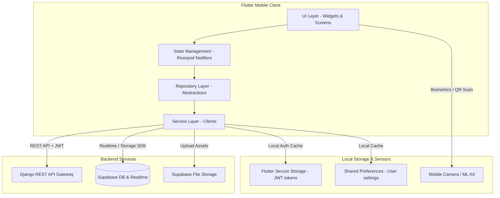
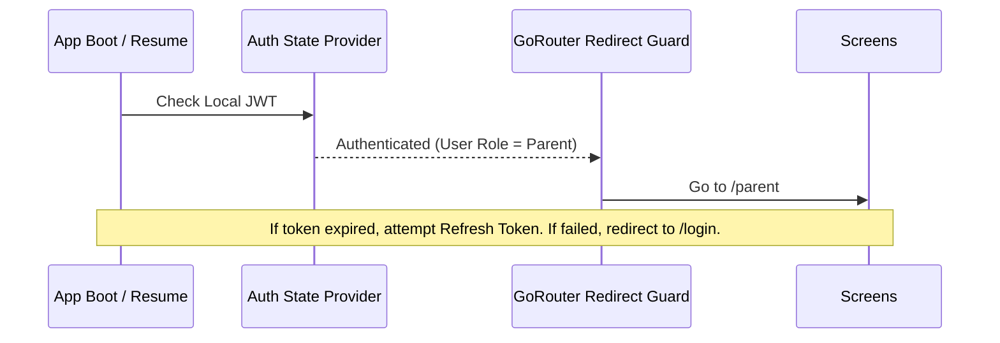
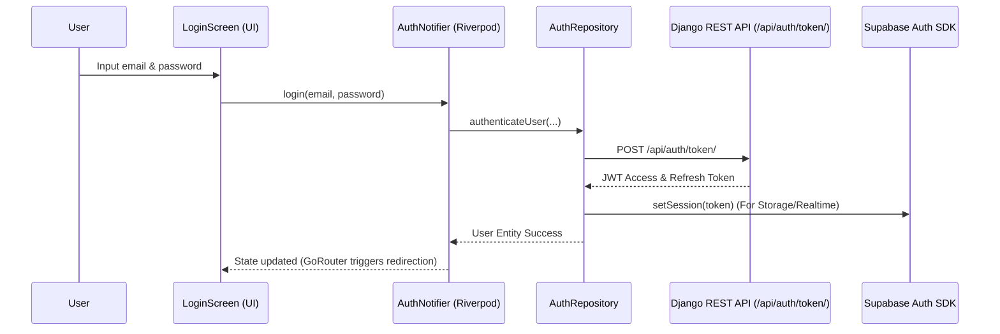

# HapoPay Flutter Mobile Design & Workflow Architecture

**Last Updated:** May 26, 2026  
**Version:** 1.1  
**Status:** Under Review (Architecture Reconciliation)  
**Author:** Flutter Architecture Team & AI Co-Developer

---

## Executive Summary

This document outlines the architectural blueprint for the HapoPay mobile application, migrating features from the existing web platform into a high-performance cross-platform iOS and Android app. 

It provides an **honest, transparent gap analysis** between the *proposed architecture* (originally draft-designed around BLoC and direct Supabase access) and the *actual codebase state* (which is initialized with Riverpod, GoRouter, and a Django backend API layer). This document reconciles these designs, maps out the structure, and details the steps required to build a secure, performant, and maintainable application.

---

## 1. Project Overview & Current State Analysis

### 1.1 Existing HapoPay Platform & Tech Stack
* **Current Web Platform:** Multi-page web application (HTML/CSS/JavaScript).
* **Backend Stack:** 
  * **Django REST API (port 8000):** Serves as the primary API layer for business logic, validation, and JWT-based authentication (`SimpleJWT`).
  * **Supabase (PostgreSQL + Auth + Storage + Realtime):** Serves as the database. The Django backend connects via `DATABASE_URL`, and clients connect directly to Supabase for storage or realtime streams where appropriate.
* **Database Schema:** 10+ tables with Row-Level Security (RLS) policies.

### 1.2 Actual Codebase Analysis (Mobile Client)
A detailed inspection of the current contents in the [`/mobile`](file:///c:/Users/admin/desktop/hapo-pay/mobile) directory shows that the application is in an early-stage skeleton setup:

* **State Management:** **Riverpod** is configured rather than BLoC.
  * Dependency list in [`pubspec.yaml`](file:///c:/Users/admin/desktop/hapo-pay/mobile/pubspec.yaml): `flutter_riverpod`, `riverpod_annotation`, `riverpod_generator`, and `build_runner`.
  * [`main.dart`](file:///c:/Users/admin/desktop/hapo-pay/mobile/lib/main.dart) wraps the app with `ProviderScope`.
* **Routing:** **GoRouter** is implemented.
  * [`core/router/app_router.dart`](file:///c:/Users/admin/desktop/hapo-pay/mobile/lib/core/router/app_router.dart) defines an `appRouterProvider` (Riverpod provider) with basic routes: `/login`, `/parent`, and `/student`.
* **Network & Database Client:** 
  * `dio` is imported for REST calls (configured to point to the Django backend via `API_BASE_URL` in `.env.example`).
  * `supabase_flutter` is initialized in `main.dart` using `SUPABASE_URL` and `SUPABASE_ANON_KEY`.
* **UI Skeleton:**
  * Screen templates in `/features` ([`login_screen.dart`](file:///c:/Users/admin/desktop/hapo-pay/mobile/lib/features/auth/presentation/login_screen.dart), [`parent_dashboard_screen.dart`](file:///c:/Users/admin/desktop/hapo-pay/mobile/lib/features/parent/presentation/parent_dashboard_screen.dart), [`student_dashboard_screen.dart`](file:///c:/Users/admin/desktop/hapo-pay/mobile/lib/features/student/presentation/student_dashboard_screen.dart)) are basic layout placeholders (`StatefulWidget`/`StatelessWidget`) without logic, models, or state integrations.
* **Environment Configuration:**
  * Configured in [`.env.example`](file:///c:/Users/admin/desktop/hapo-pay/mobile/.env.example) to target:
    ```ini
    SUPABASE_URL=https://your-project.supabase.co
    SUPABASE_ANON_KEY=your-anon-key
    API_BASE_URL=http://localhost:8000/api
    ```

---

## 2. Reconciled Systems Architecture Design

### 2.1 Reconciled High-Level Architecture
The diagram below maps how the Flutter Mobile App interacts with both the Django API Gateway and direct Supabase services (Storage/Realtime).



### 2.2 Layered Architecture Pattern

To maintain clean separation of concerns, the Flutter app is organized into four main layers inside each feature directory (following Clean Architecture principles adapted for Flutter):

#### 2.2.1 Presentation Layer (UI)
* **Screens:** Feature-specific screen widgets (e.g., `LoginScreen`, `ParentDashboardScreen`).
* **Widgets:** Small, granular, reusable UI components (e.g., `AppButton`, `AppTextField`).
* **Controllers/State:** Listens to Riverpod providers, handles UI state changes, maps events to repository actions.

#### 2.2.2 Domain Layer (Optional but Recommended for Business Rules)
* **Entities:** Pure Dart models representing core business items (e.g., `User`, `Transaction`, `Reward`).
* **Value Objects & Validators:** Rules for form fields, currency formats, and balance calculations.

#### 2.2.3 Data Layer (Repository & Models)
* **Models:** Data Transfer Objects (DTOs) with `fromJson` and `toJson` methods to deserialize network payloads.
* **Repositories:** Implementation of data operations that orchestrate caching, service requests, and error boundary resolution.

#### 2.2.4 Service Layer (Data Sources)
* **API Service (Dio):** Wrapper for requests to the Django backend, automatic JWT injection, and header interceptors.
* **Supabase Service:** Handler for real-time subscription streams (e.g., live transaction updates) and file storage uploads (e.g., receipt image uploads).
* **Storage Service:** Wrapper around `FlutterSecureStorage` and `SharedPreferences`.

---

## 3. State Management & Navigation Strategy

### 3.1 The Architectural Choice: Riverpod vs. BLoC

While the initial design draft advocated for **BLoC (Business Logic Component)** due to its event-driven nature, the codebase is pre-configured with **Riverpod**. Below is an updated, transparent evaluation based on the project's actual structure:

| Evaluation Metric | BLoC (Proposed Draft) | Riverpod (Actual Codebase & Recommended Path) |
|---|---|---|
| **Codebase Alignment** | ❌ Requires refactoring `main.dart`, replacing providers, and installing new packages. | ✅ Fully integrated; uses modern code generation (`@riverpod` annotations) for compile-time safety. |
| **Boilerplate Overhead** | High (Requires defining Events, States, and BLoC classes for every feature). | Low (Uses simple Notifier classes and auto-generated providers). |
| **State Predictability** | Excellent (Strict event-driven transitions make it deterministic). | Excellent (Using immutable state models combined with `Notifier`/`AsyncNotifier`). |
| **Dependency Injection** | Handled via `BlocProvider` or custom service locators (e.g. `GetIt`). | Built-in (Providers serve as declarative dependencies, making testing and mocking trivial). |
| **Asynchronous State** | Manual handling of Loading/Error/Success states. | Native handling via `AsyncValue` (perfect for handling data loading from REST APIs). |

#### Recommendation: Adopt Riverpod with AsyncNotifier
To minimize friction and align with the existing setup, we recommend **retaining Riverpod** but enforcing strict architectural rules:
1. Use **`AsyncNotifier`** from `riverpod_annotation` for all complex states (e.g., transaction loading, authentication changes).
2. Avoid global mutable state. Keep states local to features where possible.
3. Utilize `ref.watch` instead of direct global references to ensure reactive updates.

---

### 3.2 Routing & Navigation Flow

`GoRouter` serves as the declarative navigation framework. To build a proper production routing flow, we must implement:
* **Route Guards (Redirection):** Check authentication status using a Riverpod auth provider. Redirect unauthenticated users to `/login`, and prevent logged-in users from accessing the login page.
* **Sub-routing:** Nested routes for dashboard operations (e.g., `/parent/child/:id/limits`).

#### Reconciled Authentication Redirection Flow:


---

## 4. Reconciled Feature Architectures

### 4.1 Authentication Flow (Django + Supabase)

The authenticating client must first hit the Django backend to retrieve a JWT, which is cached locally. The app also initializes the Supabase Auth client to synchronize tokens for storage and database operations.



---

### 4.2 Parent Dashboard Architecture
* **Total Balance Widget:** Displays aggregate family and individual child balances.
* **Child Cards:** Displays child information and actions:
  * Adjust limits (hits `/api/children/{id}/` via PATCH).
  * Lock card (instant limit setting to $0).
* **Realtime Transaction Feed:** Direct Supabase realtime channel subscribing to `transactions` table changes. This updates the feed instantly without reloading the dashboard.

---

### 4.3 Student Dashboard Architecture
* **QR Payment Generator/Scanner:** Displays student's personal QR identification or launches `mobile_scanner` to scan merchant codes.
* **Gamification Hub:** Connects to Django's `/api/rewards/points/` and `/api/rewards/achievements/` to display milestones.
* **Biometric Auth Integration:** Prompts Face ID / Fingerprint check before authorizing a high-value QR payment.

---

## 5. Security & Mobile-Specific Features

### 5.1 Biometric Authentication & Secure Storage
* **Keychain / Keystore:** All JWT access and refresh tokens must be stored in `FlutterSecureStorage` using hardware-backed encryption.
* **Biometric Flow:**
  1. The user logs in via credentials first.
  2. The app requests permission to enable biometrics.
  3. If allowed, subsequent payments or logins use `local_auth` to unlock the cached credentials or token.

### 5.2 QR Payment Security
To prevent fraud and replay attacks:
* **Dynamic QR Codes:** Student-generated payment QR codes must contain a cryptographic signature, a timestamp, and a short expiration window (e.g., 60 seconds).
* **Payload Encryption:** Sensitive fields inside the QR payload should be encrypted before display.

---

## 6. Gap Analysis & Areas for Improvement

The following table lists the **current design gaps** in the `/mobile` project that must be resolved to bring the project to a production-ready status:

| Area | Current Implementation Status | Gap / What Needs to be Improved | Priority |
|---|---|---|---|
| **State Management** | Raw Riverpod structure with no controllers or notifiers. | Implement `AuthNotifier`, `ParentDashboardNotifier`, and `StudentDashboardNotifier`. Run build_runner. | **Critical** |
| **Authentication Backend** | Login screen has a mock timer and transitions to `/parent` unconditionally. | Wire up `Dio` interceptor to call Django token endpoints and manage tokens securely. | **Critical** |
| **Secure Token Storage** | Dependency `flutter_secure_storage` is imported but not used. | Create a `SecureStorageService` to cache and retrieve auth tokens. | **High** |
| **Route Security** | `GoRouter` does not have redirection guards. | Connect `GoRouter` redirects to the auth state provider to protect dashboard routes. | **High** |
| **Data Layer Abstraction** | No models (`.g.dart`), no repository classes, and no service layers. | Create feature subdirectories (`data/`, `domain/`, `presentation/`) and generate JSON serialization code. | **High** |
| **Local Cache** | `shared_preferences` installed but unused. | Implement local configuration and offline persistence cache. | **Medium** |
| **Camera & QR Scanner** | `mobile_scanner` installed but unused. | Implement QR scanner scanner overlay widget with permissions handling. | **Medium** |
| **Testing** | Empty test configuration. | Add unit tests for Notifiers and mock repository tests using `mockito` or `mocktail`. | **Medium** |

---

## 7. Actionable Roadmap & Next Steps

To address these gaps, the development team should execute the following phases:

### Phase 1: Establish the Data and Auth Foundations
1. **Directory Restructuring:** Move files into clean architecture blocks inside `features/auth/`, `features/parent/`, and `features/student/`.
2. **Secure Token Storage:** Implement `SecureStorageService` wrapper.
3. **Network Interceptor:** Create a custom `Dio` class containing a request interceptor to append the active JWT to outgoing HTTP calls and catch 401 errors for token refresh.
4. **Auth State Guard:** Integrate the authentication state stream with `GoRouter`'s redirect configuration.

### Phase 2: Feature Development
1. **Parent API wiring:** Implement transaction retrieval and child configuration (limit adjustments).
2. **Student Gamification & Transactions:** Query Django endpoints and listen to real-time transaction updates from Supabase.
3. **QR Code Scanning Screen:** Integrate `mobile_scanner` and implement the payment validation routine.

### Phase 3: Hardening & Testing
1. **Biometrics:** Add `local_auth` checks before actions.
2. **Performance Audit:** Verify that widgets utilize `const` constructors and that lists load lazily (`ListView.builder`).
3. **Test Coverage:** Build unit test suites for repositories and state notifiers.

---

*This document serves as the updated source of truth for the Flutter Mobile implementation. Developers must adhere to the reconciled Riverpod state management and Django API / Supabase hybrid service architecture.*
